# Reinforcement Learning Assisted Blackjack
## Table of Contents

* [ Try the Game ](#host)
* [ About the Project ](#about)
  * [ Presentation ](#intro)
  * [ Simplified Blackjack Rules ](#rules)
* [ Reinforcement Learning ](#rl)
  * [ Q-Learning ](#q_learn)
  * [ Monte-Carlo Sampling ](#mcc)
  * [ Temporal Difference Bootstrapping ](#td)
* [ Creating the Model ](#model)
* [ Creating the Game ](#game)

---

##  Try the Game

You can try the final result using this [link](https://simmer.io/@Prissad/reinforcement-learning-assisted-blackjack).

---

##  About The Project

###  Presentation

This personal project aims to create a **Video Game** about *Blackjack* with *simplified rules* and add a **Reinforcement Learning A.I** to it that can advise the player of the best strategy.

Tools used:
* Unity
* Python Notebooks
* Flask

  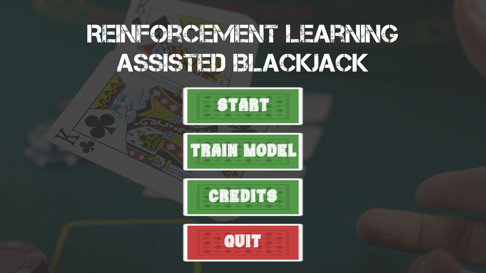
  (The final game's main menu)

###  Simplified Blackjack Rules

Used Blackjack **simplified** Rules:
* The goal of blackjack is to beat the dealer's hand without going over 21. Face cards are worth 10. Aces are worth 11.
* Each player starts with two cards, one of the dealer's cards is hidden until the end.
* To 'Hit' is to ask for another card. To 'Stick' is to hold your total and end your turn.
* If you go over 21 you bust, and the dealer wins regardless of the dealer's hand.
* If you are dealt 21 from the start (Ace & 10), you got a blackjack.
* The Dealer must hit as long as his total in under 17 and must Stick as he reaches 17 or higher.
* Each player can only have a maximum of 5 cards in his hand.
* A tie means that nobody wins.

---

##  Reinforcement Learning

###  Q-Learning

Q-learning is a  **model-free** reinforcement learning algorithm. Since there are no labels, a reward system is used instead by setting the **Game Rules** and defining what is considered a *positive outcome* (**reward**) and what is considered a *negative outcome* (**punishment**). When starting to train your model, it will start taking random **Actions** (the randomness strategy can also be set) from different **States** and check the different outcomes. A *score* is set and updated each time for (State, Action) pair based on the actual score value, a Learning rate, the maximum expected reward possible and the actual reward found:

  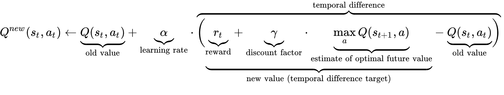
  (Update sequence of the Q value)

For the Blackjack example, it's either *Win* or *Lose* or *Tie*, so the possible operation on the reward are **increment**, **decrement** (for example by 1) or keep it as it is. The possible *States* are the Player and Dealer **known hand values**. The possible actions are **Hit** or **Stick** given a State.

###  Monte-Carlo Sampling

The Monte-Carlo Control (**MCC**) method is a technique based on **Sampling**, meaning that **Random Episodes** are fully played using the specified strategies, and the Q value is observed at the end of each episode for the entire sequence (all the State,Action pairs passed).

> The **update step** seen from the inside of the MCC agent’s head goes as follows: “if the played game was a *win* (resp. loss), the values of the **state-action sequence** I have taken should be *increased* (resp. decreased)”.

In the Blackjack case, for example if the Player wins, all the States (all the player turns where he's given his hand value and the Dealer's visible hand value) along with all their paired taken Actions (Hit or Stick) will have Q value reward incremented.

By repeating this sampling multiple time, we can approach an **optimal Q function** that gets smoother as the total played samples increases:

  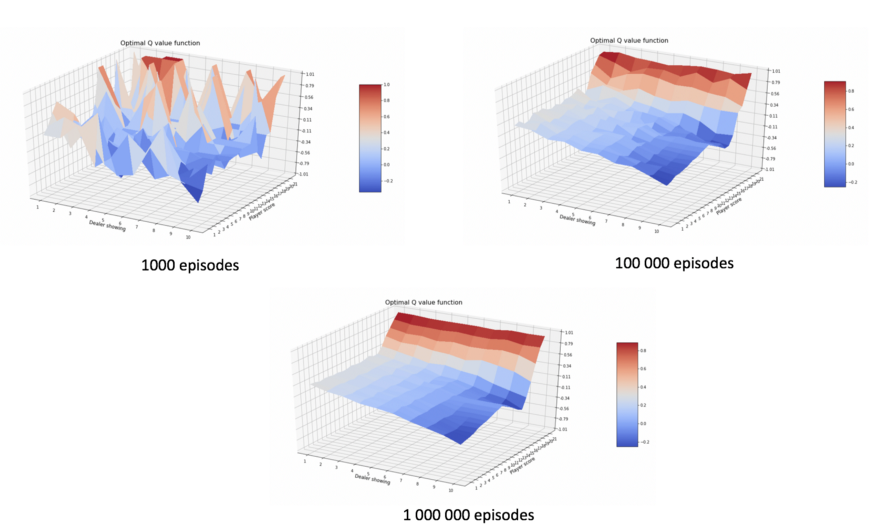
  (Q function variation depending on the number of games played)

###  Temporal Difference Bootstrapping

Temporal Difference (**TD**) is the generalization of how the Q-Learning works as the Q value update frequency is respective to a parameter called the **Eligibility Traces**. The **Trace Factor** is comprised between 0 and 1 and represents the *trace-decay* speed (closest to 0 means a faster fading).

The Q value update is made using an existing estimation, this is why we call this approach a **Bootstrapping** method:

  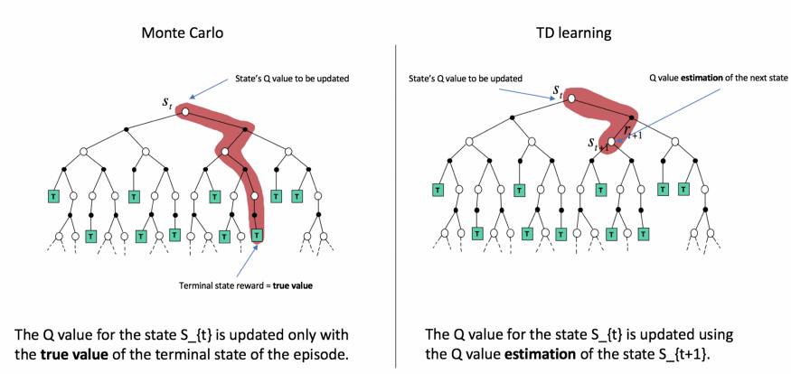
  (Q value update comparison between MCC and TD)

Taking an Eligibility Traces value equal to 1 takes us back to the exact Monte-Carlo situation as the *update step* became the entire episode.

By doing a few experiments, we can conclude that a **smaller** Trace Factor take **more time to learn** (to stabilize) but gives **less error** when it does:

  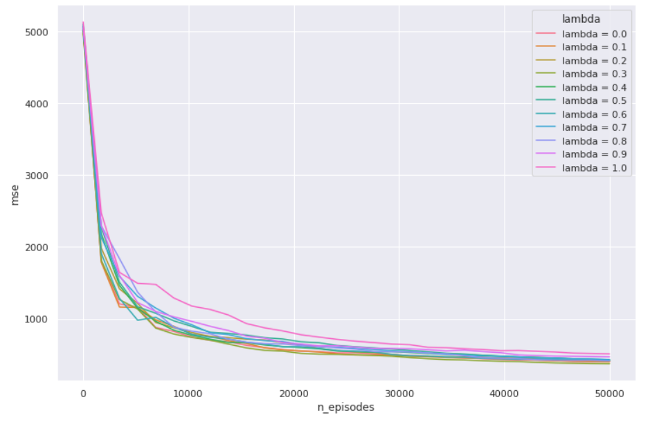
  (Mean Squared Error against number of episodes (capped at 50 000) for different values of Trace Factors)

---

##  Creating the Model

You can check the detailed model creation by visiting my Python Notebook on [Google Colab](https://colab.research.google.com/drive/1nERpnZwtH7pQ_41bS5t4ZF8h6XpoD-yU?usp=sharing) or on [Github](https://github.com/Prissad/Blackjack-Reinforcement-Learning/blob/main/Python_Notebook/Blackjack_RL.ipynb).

---

##  Creating the Game

First Step was creating a Service to apply the Reinforcement Learning. For that purpose, the model was converted into a **Flask** app that takes the *Training Method* and the other needed parameters, trains the model, then returns the **Optimal Policy** found to be used.

Second was the Visual Game which was created using **Unity** and **C#**:

* Basic rules implementation

  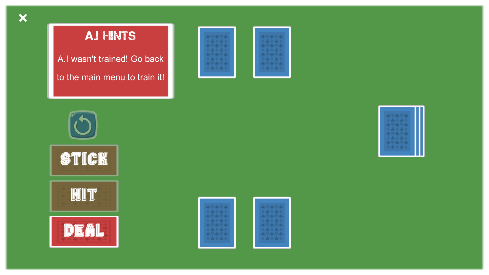
  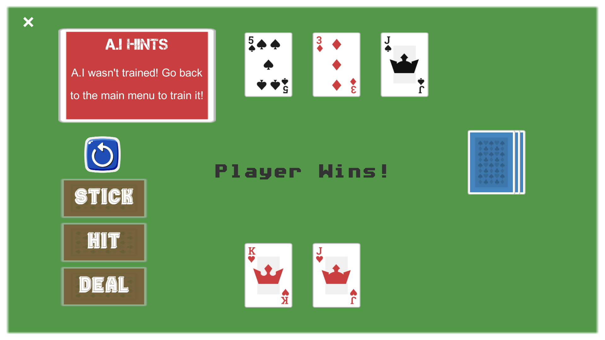

* Training the A.I

  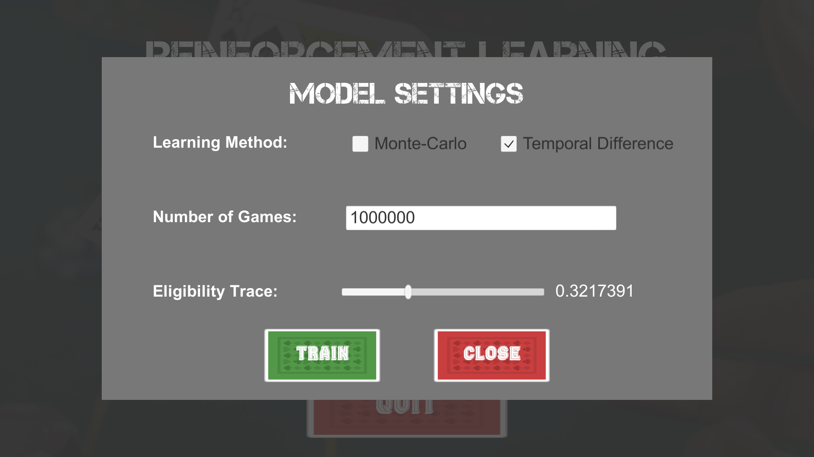
  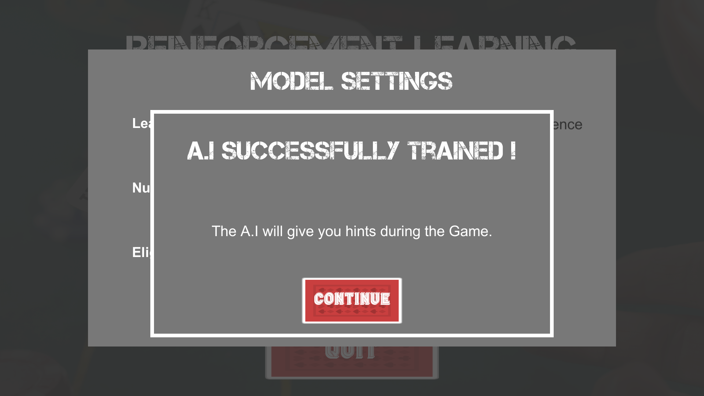

* Get A.I hints during Game

  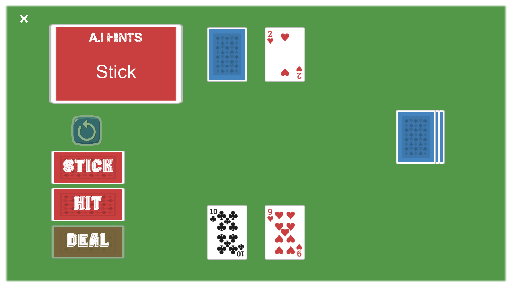
  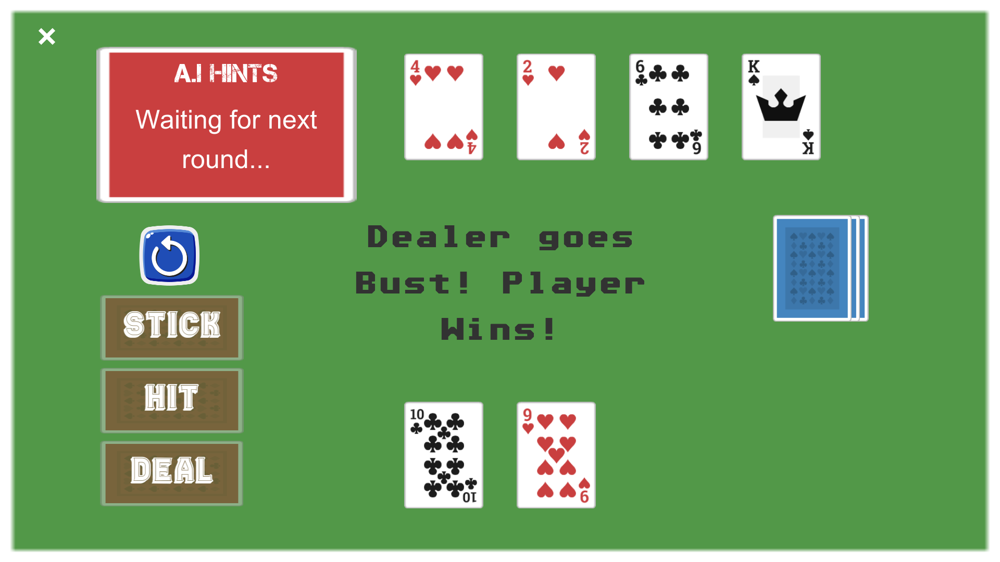

---
You can check the final result [here](https://simmer.io/@Prissad/reinforcement-learning-assisted-blackjack).